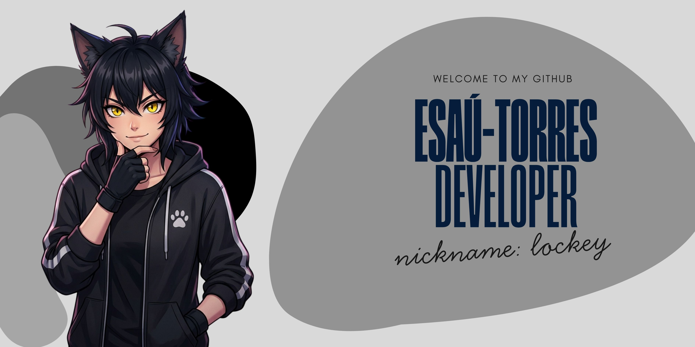

  

 

  
  
  
  

 

###

<h1 align="center">Full Stack middle | Developer.</h1>

###

<h3 align="left">👩‍💻  About Me</h3>

###

I'm  from El Salvador  - 🔭 I worked at DataSystem as a teacher and at Tkiero as a frontend developer. - 📚 I'm currently learning English and new tecnologies with cloud AI - ⚡ In my free time I like to read and program challenges to improve my programming logic.

###

<h3 align="left">🛠 Language and tools</h3>

###

  
  
  
  
  
  
  
  
  
  
  
  
  
  
  
  
  
  
  
  
  
  
  
  
  
  
  
  
  
  
  
  
  
  
  
  
  
  
  
  
  
  
  
  
  
  
  
  
  
  
  
  
  
  
  
  
  
  
  
  
  
  
  
  
  
  
  
  
  

###

<h3 align="left">🔥   My Stats :</h3>

###

  

###

  

###

  
  

### ⚡ Recent activity
<!--START_SECTION:activity-->
<!--END_SECTION:activity-->
